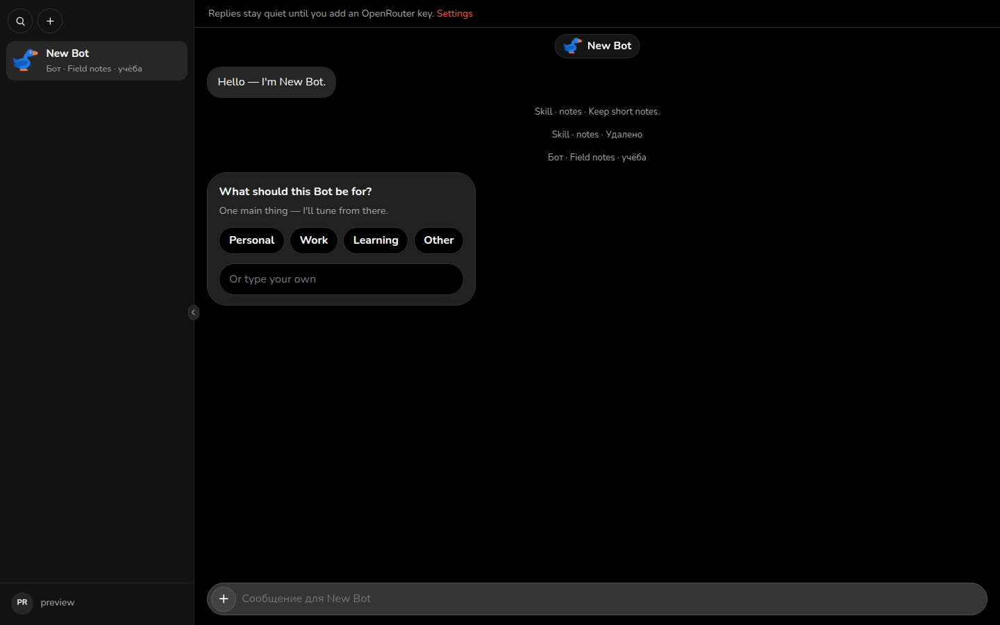
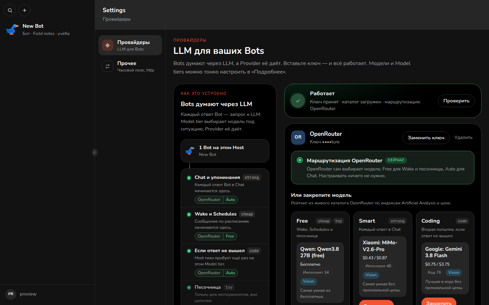

# Dostigus 🪿

Self-host household agent OS — Bots, Chat, and Schedules on your machine. Not another chatbot UI.



*Chat on the Host: a Bot thread with Skill and self-settings system lines.*



*Settings → Providers: an OpenRouter key on the shelf, with Model tiers and the live catalog.*

## Why

Grok Bot and OpenClaw-style desktop agents keep the loop on someone else’s box, or on a laptop that has to stay awake. Dostigus is the other shape: **your Host**, a SQLite **Store**, and **your** keys.

You run a **Cluster**. You add **Household** Members. Bots talk through an **MCP surface** against that Store. You pick **Providers** — OpenRouter first, plus OpenAI and OpenAI-compatible — and bind **Model tiers** instead of baking a model list into the repo.

Portable Module packages, Apply, and a marketplace are the direction, not day-1 shipping. This Host already runs Chat, Skills, Schedules, Artifacts, and Household Members. Do not read that as a store you browse and install.

## What you get

- **Cluster** — one Household’s running instance: Store, Bots, and settings. Not the git repo.
- **Host** — the client app: Chat, Cards, and Sheets from the Kit.
- **Bot** — a long-lived persona with Skills and MCP access. A Bot is not a Module package.
- **Skill** — instructions a Bot follows. Not executable UI.
- **Schedule** — a Store row that says when the Host wakes a Bot.
- **Artifact** — a persisted Cluster file (upload or Bot put), joined onto a Chat line.
- **Provider** — an Owner-connected LLM gateway instance (OpenRouter, OpenAI, or OpenAI-compatible).
- **Model tier** — `cheap` / `strong` / `code` (plus `toy`): each binds to a Provider + Policy.
- **Household** — the Owner and the Members on one Cluster.
- **MCP surface** — the tools a Bot (and the Host) use to read and write the Store.

## Quick start

Self-host is the intended path:

```bash
docker compose -f docker/compose.yml up --build
```

Open [http://localhost:3000/](http://localhost:3000/). Create the Owner. In **Settings → Providers**, add an OpenRouter (or other) key. Env, Store volume, and MCP token: [`docs/deploy.md`](docs/deploy.md).

### Develop

```bash
pnpm install
pnpm --filter @dostigus/web dev   # http://localhost:3000/
CI=1 pnpm check
```

Preview seed, smoke, and `pnpm shoot:preview` live in [`AGENTS.md`](AGENTS.md).

## Architecture

The **Platform** is this git monorepo. A **Cluster** is a running instance plus its Store. They are not the same thing.

The Host renders Kit Chat, Cards, and Sheets. Bots call the MCP surface against the Store. The LLM gateway is Providers + Policy + Model tiers ([ADR 0036](docs/adr/0036-llm-providers-tier-resolve-escalate.md)).

Scope: [`docs/SPEC.md`](docs/SPEC.md). Glossary: [`CONTEXT.md`](CONTEXT.md). Decisions: [`docs/adr/`](docs/adr/).

## Status

Early. Self-host first. MIT.

Day-1 does **not** ship a Builder Apply marketplace, Share links or guests, a managed hosting product, or a weather Module seed as a product claim. Portable Module packages stay later. See [`docs/SPEC.md`](docs/SPEC.md).

## License

[MIT](LICENSE)
